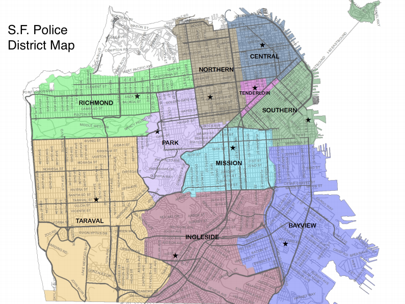
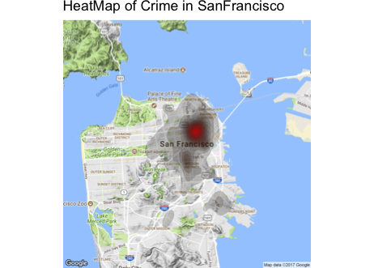

  
  
  
  
## Load all packages
  
We have used `tidyverse` and `lubridate` for data cleaning & manipulation and for basic EDA, `ggmap` for additional EDA and `nnet` for our model. To compute the multi-class log loss for our cross validation, we used the `ModelMetrics` package.

```{r, message=FALSE, warning=FALSE, fig.width=8, fig.height=4.5, echo=FALSE}
library(tidyverse)
library(ggmap)
library(gridExtra)
library(ggExtra)
library(viridis)
library(nnet)
library(lubridate)
library(RColorBrewer)
library(ModelMetrics)
library(car)
library(knitr)
```


## Load data and perform data cleaning

```{r, message=FALSE, warning=FALSE, fig.width=8, fig.height=4.5, echo=FALSE}
# Load Data
#load train data
train <- read_csv("data/train.csv")
#load test data
test <- read_csv("data/test.csv")
```

We are going to create three more variables (`Year`,`Month`, `Hour`) from the given `Dates` variables for EDA purposes.

```{r, eval= FALSE, message=FALSE, warning=FALSE, fig.width=8, fig.height=4.5, echo=FALSE}
# Data Cleaning
## Train
### Extract year, month and hour
train1 <- train %>% 
  mutate(formatted_date = strftime(Dates, "%Y-%m-%d %H:%M:%S")) %>% 
  mutate(Year = year(formatted_date),
         Month = month(formatted_date),
         Hour = hour(formatted_date),
         ID = seq(1:nrow(train))
  ) 

### Extract Top Five Crimes for visualization
group_data_category <- train1 %>% 
  group_by(Category) %>% 
  summarise(count = n()) 

#### order in descending order
ordered_data <- group_data_category[order(-group_data_category$count),] 
top_5 <- ordered_data[1:5,1]

### Group data 
grouped_train_data <- train1 %>% 
  group_by(Hour, DayOfWeek, Month, Year)

## Test
### Extract year, month and hour
test1 <- test %>% 
  mutate(formatted_date = strftime(Dates, "%Y-%m-%d %H:%M:%S")) %>% 
  mutate(Year = year(formatted_date),
         Month = month(formatted_date),
         Hour = hour(formatted_date)
  )

```


## EDA visualizations and tables

Our original test data has nine variables as seen in the table below. Our test set has the same variablees except for `Category` (our response variable), `Descrip` and `Resolution` as the two latter variables would include the category of the crime reported. Each observation in our data set represents a crime reported between 1/1/2003 and 5/13/2015. Our train set has `878,049` observations while our test set has `884,262` observations. The weeks were numbered and crimes reported in odd-numbered weeks formed the train set and the rest formed our test set.

```{r, echo=FALSE}
# Table with variable description
var_name <- c(names(train[1:9]))
var_description <- c("timestamp of the crime incident", 
                     "category of the crime incident (our reponse variable)", 
                     "detailed description of the crime incident", 
                     "the day of the week",
                     "name of the Police Department District",
                     "how the crime incident was resolved",
                     "the approximate street address of the crime incident",
                     "Longitude",
                     "Latitude"
)
tbl <- cbind(var_name,var_description)
colnames(tbl) <- c("Name", "Description")
names(dimnames(tbl)) <- list("", "Variable Description")
tbl %>% knitr::kable(digits=4, caption= "Original Variables with Description", align = 'l')
```


We next looked at a map showing San Francisco broken down by Police Districts. This map gives us a better idea on the scope of the project and helps us to visually identify the Police District names found in our data set. One interesting observation is that the richest district in the city, Presidio, is the only part of the map below without a police district assigned to it. Due to this, we have decided to use Police District as our variable for crime location instead of `Address` or `longitude` and `latitude`.





Our next step was to look at the breakdown of crime by `Category`. This allows us to identify the most and least common type of crimes reported. We are also able to understand how our observations are divided.


```{r, echo=FALSE}
# Overall distribution of crimes
g1 <- ggplot(ordered_data) +
  geom_bar(aes(x= reorder(Category, -count), 
               y=count,
               color = reorder(Category, -count),
               fill = reorder(Category, -count)),
           stat = "identity") +
  coord_flip()

g1 + ggtitle("Number of crimes in each category") +
  xlab("Number of crimes") +
  ylab("Category of crime") + 
  theme(legend.position="none") 
```


From the graph above we see that `LARCENY/THEFT` is the Number 1 most reported crime category. The bottom 10 categories seem to have low reported number of incidents. Indeed, the top 10 crime categories accounted for over 83 % of total number of crimes reported and the top 20 crime categories accounted for over 96%. We have therefore decided to concentrate on predicting top crimes when making our model to increase accuracy. Theft seems to be the number 1 crime reported as `LARCENY/THEFT`, `BURGLARY`, `VEHICLE THEFT`, `ROBBERY` are all thefts and they are in our Top 15 crimes reported. We will use this broad categorization to analyze type of crime against the different predictor variables such as the hour crimes were committed, day of week crimes occurred, and area in which crimes were reported using Police Dept District.


```{r, echo=FALSE, eval=FALSE}
# Breaking down crime categories by Top 10 and Top 20.

top_10 <- ordered_data[1:10,1:2]
sum(top_10$count)/nrow(train) * 100
top_20 <- ordered_data[1:20,1:2]
sum(top_20$count)/nrow(train) * 100
```


```{r, echo=FALSE}
# Crime distribution by weekday

train4 <- train1 %>% 
  group_by(DayOfWeek,Year, Month) %>% 
  summarise(count = n())


train4$DayOfWeek = factor(train4$DayOfWeek, levels= c("Monday", 
                                                      "Tuesday", "Wednesday", "Thursday", "Friday", "Saturday","Sunday"))

g3 <- ggplot(train4, 
             aes(x=DayOfWeek, y=count,
                 fill = DayOfWeek)) + 
  geom_boxplot()

g3 + ggtitle("Crime distribution by weekday") +
  xlab("weekday") +
  ylab("Number of crime incidents") +
  theme(legend.position = "None",plot.title = element_text(hjust = 0.5))

```

From the weekday graph it would seem that Sunday has seen the lowest median of crimes committed. This is probably because most people are at home on Sunday. Friday has the highest median, and this is probably because people are most likely to go out on Fridays. So `weekday` would be a good predictor of theft, and crimes by extension.

```{r, echo=FALSE}
# Crime distribution by Hour

train5 <- train1 %>% 
  group_by(Hour, Year, Month) %>% 
  summarise(count = n())

g3 <- ggplot(train5, 
             aes(x=as.factor(Hour), y=count,
                 fill = as.factor(Hour))) + 
  geom_boxplot()

g3 + ggtitle("Crime distribution by hour") +
  xlab("hour") +
  ylab("Number of crime incidents") +
  theme(legend.position = "None",plot.title = element_text(hjust = 0.5))

```

From the hour of the day breakdown we notice that most crimes occur during the day (from 8 am to around 6 pm). This is the time window when people commute to work and are at work. So `hour` would be a good predictor of theft, and crimes by extension.

```{r, echo=FALSE}
# Crime distribution by Month

train3 <- train1 %>% 
  group_by(Month,Year) %>% 
  summarise(count = n())

g3 <- ggplot(train3, 
             aes(x= as.factor(Month), 
                 y=count,
                 fill = as.factor(Month))
) + 
  geom_boxplot()

months <- c("Jan", "Feb", "Mar", "Apr","May","Jun", 
            "Jul", "Aug", "Sep", "Oct", "Nov", "Dec")

g3 + ggtitle("Crime distribution by month") +
  xlab("month") +
  ylab("Number of crime incidents") +
  theme(legend.position = "None", plot.title = element_text(hjust = 0.5)) +
  scale_x_discrete(breaks = 1:12, labels = months, position = "bottom")

```

From the `Crime distribution by month` we notice that October has the highest median. That seemed odd considering there are no major holidays in October. We thought this might be due to the way the training and test set were split. Odd numbered weeks were assigned to the train set and the rest to the test set. So major holiday weeks might have gone in the test set. So `Month` would not be a good predictor.

```{r, echo=FALSE}
# Crime distribution by PdDistrict

train6 <- train1 %>% 
  group_by(PdDistrict, Year, Month) %>% 
  summarise(count = n())

g3 <- ggplot(train6, 
             aes(x=as.factor(PdDistrict), y=count,
                 fill = as.factor(PdDistrict))) + 
  geom_boxplot()

g3 + ggtitle("Crime distribution by Police District") +
  xlab("Police District") +
  ylab("Number of crime incidents") +
  theme(legend.position = "None", 
        plot.title = element_text(hjust = 0.5),
        axis.text.x = element_text(angle=45, hjust =1))

```

The Southern District seems to be leading in terms of number of crimes being reported. From the distribution of reported crime by district, it would seem that Police District would be a good preditor of crime as we clearly seem different patterns in the overall distribution.

From the above plots, `PdDistrict`, `DayOfWeek` and `Hour` seem to indicate when thefts are highly to occur. Since our broad definition of thefts account for most crimes reported, we believe that these variables would be good indicators of the type of crime in general, likely to have been committed.

## Ultimate model

For our ultimate model, we have decided to use `multinomial logistic regression` because our reponse variable is a categorical outcome variable. We have decided to use `PdDistrict`, `DayOfWeek` and `Hour` variables from our EDA as our predictor variables. Also, they were all significant predictor variables when we ran our `Anova` test. We used a sample of size 200,000, which is roughly a quarter of our train set. This decision was made due to computation time and we also used `maxit` to get more accurate results. Multinomial logistic regression is used to model categorical outcome variables, where the log odds of the outcomes are modeled as a linear combination of the predictor variables. We used the `multinom()` function from the `nnet` library to estimate a multinomial logistic regression model. We ran our multinorm model over 200 iterations to get a good model.

```{r, echo=FALSE, eval=FALSE}
set.seed(495)
train_samp = sample_n(train1, 200000)
```

```{r, eval=FALSE}
m1 <- multinom(Category ~ PdDistrict + DayOfWeek +  Hour, 
               data = train_samp, maxit = 200)
```

```{r, echo=FALSE, eval=FALSE, fig.width=8, fig.height=4.5,}
anov <- Anova(m1)
# Results
Analysis of Deviance Table (Type II tests)

Response: Category
LR Chisq  Df Pr(>Chisq)    
PdDistrict  31549.9 342  < 2.2e-16 ***
DayOfWeek    8370.1 228  < 2.2e-16 ***
Hour         6494.4  38  < 2.2e-16 ***
---
Signif. codes:  0 ‘***’ 0.001 ‘**’ 0.01 ‘*’ 0.05 ‘.’ 0.1 ‘ ’ 1
```

Our Anove results:
  
```{r, echo=FALSE}
print(anov)
```

## Crossvalidation of ultimate model

For our cross-validation, we have decided to use 5-fold coss-validation. We divided our data into five equal folds each containing 40,000 unique observations. The sample were generated from the training sample of 200,000 observations we used to run our ultimate model on. Our cross-validation results was 2.8, in terms of multi-class log loss error.

```{r, message=FALSE, include=FALSE, eval=FALSE, warning=FALSE, fig.width=8, fig.height=4.5, echo=FALSE}

set.seed(495)

#This is a function that will create a six-fold cross validation with degrees of freedom and the dataset as inputs and return the average Mean Square Error


validation1 <- train_samp %>%  #first fold
  sample_n(40000)
training1 <- train_samp %>% 
  anti_join(validation1, by="ID")

validation2 <- training1 %>% #second fold
  sample_n(40000)
training2prime <- training1 %>% 
  anti_join(validation2, by="ID")
training2 <- training2prime %>%
  bind_rows(validation1)

validation3 <- training2prime %>% #third fold
  sample_n(40000)
training3prime <- training2prime %>% 
  anti_join(validation3, by="ID")
training3 <- training3prime %>%
  bind_rows(validation2) %>%
  bind_rows(validation1)

validation4 <- training3prime %>% #fourth fold
  sample_n(40000)
training4prime <- training3prime %>% 
  anti_join(validation4, by="ID")
training4 <- training4prime %>%
  bind_rows(validation3) %>%
  bind_rows(validation2) %>%
  bind_rows(validation1)


validation5 <- training4prime #fifth fold
training5 <- training4 %>% 
  anti_join(validation5, by="ID")
training5 <- training5 %>%
  bind_rows(validation4)


model1 <- multinom(Category ~ PdDistrict + DayOfWeek +  Hour, 
                   data = training1, maxit = 200) #first fitted model
test_1 <- predict(model1, validation1, type = "probs") %>% data.matrix()
mll1<- mlogLoss(validation1$Category, test_1)

model2 <- multinom(Category ~ PdDistrict + DayOfWeek +  Hour, 
                   data = training2, maxit = 200) #second fitted model
test_2 <- predict(model2, validation2, type = "probs") %>% data.matrix()
mll2<- mlogLoss(validation2$Category, test_2)

model3 <- multinom(Category ~ PdDistrict + DayOfWeek +  Hour, 
                   data = training3, maxit = 200) #third fitted model
test_3 <- predict(model3, validation3, type = "probs") %>% data.matrix()
mll3 <- mlogLoss(validation3$Category, test_3)

model4 <- multinom(Category ~ PdDistrict + DayOfWeek +  Hour, 
                   data = training4, maxit = 200) #fourth fitted model
test_4 <- predict(model4, validation4, type = "probs") %>% data.matrix()
mll4 <- mlogLoss(validation4$Category, test_4)

model5 <- multinom(Category ~ PdDistrict + DayOfWeek +  Hour, 
                   data = training5, maxit = 200) #fifth fitted model
test_5 <- predict(model5, validation5, type = "probs") %>% data.matrix()
mll5<- mlogLoss(validation5$Category, test_5)

cvscore <- (mll1 + mll2 + mll3 + mll4 + mll5)/5

cvscore

```

```{r, echo=FALSE}
print("cvscore: ")
print(cvscore)
```


## Create submission

On submitting our best model on Kaggle, we got a score of around 2.6 which is close to our crossvalidation multi-class log loss of 2.8.

```{r, echo=FALSE, eval=FALSE}
id <- 0:884261
predictions <- predict(m1, test1, "probs")
pred1 <- format(predictions, sci = FALSE)
pred1 <- cbind(id, pred1)
pred1 <- as.data.frame(pred1)
write_csv(pred1, path = "data/submission.csv")
```


## Citations and references

* Data sets. Retrieved from https://www.kaggle.com/c/sf-crime

* Multinomial Logistic Regression. Retrieved from https://stats.idre.ucla.edu/r/dae/multinomial-logistic-regression/
  
* San Francisco Police Dept. District Map. Retrieved from http://hoodline.com/2015/07/citywide-sfpd-redistricting-to-take-effect-sunday 

## Supplementary materials



```{r, echo=FALSE, warning=FALSE, message=FALSE, eval=FALSE}
sfMap<-get_map(location="sanfrancisco", zoom= 12, source="google")
ggmap(sfMap, extent='device', legend="topleft")+
  stat_density_2d(data=sample_n(train,10000),
                  aes(x=X,y=Y,fill=..level..),size=.01,bins=16,geom="polygon",alpha=.2,show.legend = F)+
  scale_fill_continuous(low="black",high="red")+
  ggtitle('HeatMap of Crime in SanFrancisco')
```

The heatmap plot allows us to visualize crime distribution in SanFrancisco.  As we observed in the barplot, most crime occurrs around the districts in the top right of the city, especially the Tenderloin.
